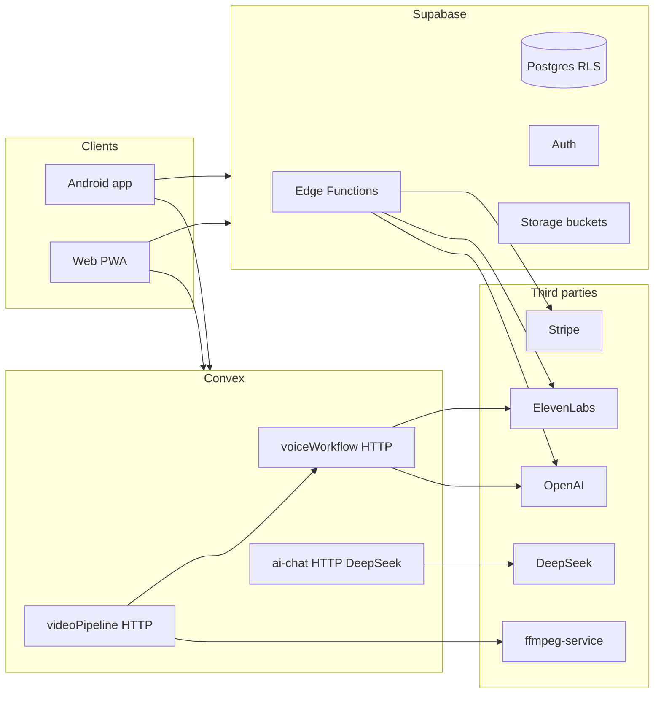

# DeltaVoice production deployment (Supabase + Convex)

## Current architecture (what the code actually does)

- **Voice “complete” workflow:** Android [`CompleteVoiceWorkflowService.kt`](app/src/main/java/com/deltavoice/api/CompleteVoiceWorkflowService.kt) tries **Convex** first when [`ConvexConfig.USE_CONVEX_FOR_VOICE_WORKFLOW`](app/src/main/java/com/deltavoice/config/ConvexConfig.kt) is true, then **falls back** to Supabase `complete-voice-workflow`.
- **Convex voice logic** duplicates Supabase-style processing in [`convex/voiceWorkflow.ts`](convex/voiceWorkflow.ts) (OpenAI + ElevenLabs env vars).
- **AI chat provider differs by route:** Supabase [`supabase/functions/ai-chat/index.ts`](supabase/functions/ai-chat/index.ts) uses **OpenAI**; Convex [`convex/http.ts`](convex/http.ts) `/ai-chat` uses **DeepSeek** (`DEEPSEEK_API` / `DEEPSEEKA`). Clients that call Convex for chat must have DeepSeek configured in **Convex dashboard env**, not only OpenAI in Supabase.
- **Video:** [`convex/videoPipeline.ts`](convex/videoPipeline.ts) requires `FFMPEG_VIDEO_SERVICE_URL` and optional `FFMPEG_SERVICE_API_KEY`, plus a deployed [`ffmpeg-service`](ffmpeg-service/).

## Critical gaps before “ship”

### 1. Secrets and config hygiene (blocker)

- [`SupabaseConfig.kt`](app/src/main/java/com/deltavoice/config/SupabaseConfig.kt) contains a **real `SUPABASE_ANON_KEY` in source**. Treat as compromised: **rotate the anon key** in Supabase, then stop committing keys—use `BuildConfig` / CI as described in [`SECURE_CONFIG_GUIDANCE.md`](SECURE_CONFIG_GUIDANCE.md).
- [`ConvexConfig.kt`](app/src/main/java/com/deltavoice/config/ConvexConfig.kt) and [`web/config.js`](web/config.js) embed a **specific Convex `.convex.site` URL**. For production, inject per flavor (debug/staging/prod) or build-time overrides so dev/staging cannot hit prod Convex.
- **Convex environment** (dashboard): set at least `OPENAI_API_KEY` (or `OPENAI_API_KEY77`), `ELEVENLABS_API_KEY` (or `*_77` variants per code), `DEEPSEEK_API` or `DEEPSEEKA` for chat, `FFMPEG_VIDEO_SERVICE_URL` (+ API key) if video is live.
- **Supabase Edge secrets**: mirror the same provider keys used by functions you still call from web/Android fallback (`OPENAI_*`, `ELEVENLABS_*`, `STRIPE_SECRET_KEY`, etc.—see each function under [`supabase/functions/`](supabase/functions/)).

### 2. Single product story for two backends (avoid drift)

- **Document** which features are “primary” on Convex vs Supabase and run a **smoke test matrix** (voice complete, voice-only, video dub, AI chat, free translate, voice clone) on **both** paths if fallback stays enabled.
- **Version skew risk:** logic lives in both [`complete-voice-workflow`](supabase/functions/complete-voice-workflow/index.ts) and [`voiceWorkflow.ts`](convex/voiceWorkflow.ts). For long-term maintenance, either accept periodic parity reviews or **pick one source of truth** (e.g., Convex-only + thin Supabase for auth/billing only).

### 3. Billing and subscription correctness

- Checkout is implemented in [`create-checkout/index.ts`](supabase/functions/create-checkout/index.ts); subscription reads sync in [`check-subscription/index.ts`](supabase/functions/check-subscription/index.ts) by querying Stripe.
- **Missing piece:** there is **no Stripe webhook function** in-repo for `customer.subscription.updated/deleted`, payment failures, etc. Without it, `subscribers` can be **stale** until the client calls `check-subscription`. **Recommendation:** add a `stripe-webhook` edge function, verify signatures, upsert `subscribers`, and use Stripe Price IDs for plans instead of only inline `price_data` (better analytics and portal alignment).

### 4. Security / abuse (multi-backend surface)

- **CORS is `*`** on Convex ([`voiceWorkflow.ts`](convex/voiceWorkflow.ts)) and many Supabase functions—convenient but **any site can call your HTTP endpoints** if they obtain the public anon key or guess URLs. Mitigations: restrict origins for web, **rate limiting** (Supabase built-in or API gateway), **request size limits**, and **auth on expensive routes** (JWT from Supabase passed to Convex or signed short-lived tokens).
- Review **RLS** on [`subscribers`](supabase/migrations/20250702190342-e462e8b0-9bfc-4a32-b5ba-b4af3dc02c79.sql): `INSERT`/`UPDATE` policies with `USING (true)` are **over-permissive** for service-role patterns—tighten so only service role or controlled edge functions can write.
- [`translated-videos`](supabase/migrations/20250618153805-39092d05-9edf-4c24-9b9d-54c8c5c6ae33.sql) bucket is **public** with broad object policies—align with privacy policy and consider **private bucket + signed URLs** for production.

### 5. Operational deployment checklist

| Area | Action |
|------|--------|
| Supabase | Run all migrations; deploy **all** edge functions; set secrets; confirm Auth redirect URLs for prod domain |
| Convex | `npx convex deploy`; set prod env vars; confirm HTTP routes in [`convex/http.ts`](convex/http.ts) |
| ffmpeg-service | Deploy container/host; TLS; lock down to Convex egress IP or shared secret (`FFMPEG_SERVICE_API_KEY`) |
| Web | Deploy `web/` (e.g. Vercel per README); set `data-convex-url` / env for Convex URL; ensure `config.js` Supabase values are build-time, not stale |
| Android | Release signing; Play Console **Data safety**; remove debug ingest if any debug-only telemetry remains; optional certificate pinning per [`SECURE_CONFIG_GUIDANCE.md`](SECURE_CONFIG_GUIDANCE.md) |
| Observability | Reduce **PII in logs** (edge functions log message snippets today); central errors (Sentry/etc.) without raw user content |

### 6. Legal / product polish

- Host the privacy policy (updated for **both** Supabase and Convex subprocessors, **DeepSeek** for Convex chat, **public video storage** if still used).
- Terms of service, support contact, and in-app “Data & AI” disclosure for voice cloning (ElevenLabs).

## Suggested implementation order

1. Rotate leaked anon key; move Android/web config to **non-committed** build injection.
2. Lock down **Convex + Supabase** env vars and document them in one internal runbook.
3. Add **Stripe webhook** + tighten **subscribers RLS**; test cancel/renew.
4. Decide **CORS + auth** strategy for Convex HTTP (minimal: API key header for Convex-only clients, or Supabase JWT validation inside Convex).
5. Harden **storage** for translated video if the feature ships.
6. Run full E2E tests from Android + web against **production** projects (not dev Convex URL).
