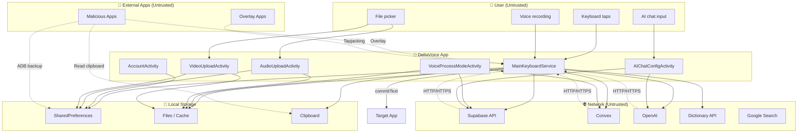

# Security Threat Model — DeltaVoice Android Keyboard App

**Generated:** Micro-Instruction 2 (Threat Model & Attack Surface)  
**References:** SECURITY_VULNERABILITY_MAP.md, OWASP MSTG, STRIDE

---

## 1. Trust Boundaries

| Boundary | Trust Level | Description |
|----------|-------------|-------------|
| **User** | Untrusted | Keyboard input, voice recordings, file picks, AI chat messages |
| **System (Android)** | Trusted | IME framework, InputConnection, ContentResolver, permissions |
| **Network** | Untrusted | Internet, Wi‑Fi, cellular; MITM possible |
| **Third-party apps** | Untrusted | Malicious apps, overlay apps, clipboard readers |
| **External APIs** | Partially trusted | Supabase, Convex, OpenAI, dictionary API, Google search |
| **Supabase/Ktor SDK** | Partially trusted | Depends on SDK security and config |

---

## 2. Data Flow Diagram (Mermaid)



---

## 3. Attack Surface Diagram (ASCII)

```
┌─────────────────────────────────────────────────────────────────────────────────┐
│                        DELTAVOICE ATTACK SURFACE                                  │
├─────────────────────────────────────────────────────────────────────────────────┤
│                                                                                  │
│   ┌─────────────┐     ┌─────────────────────────────────────────────────────┐  │
│   │   USER      │     │              DELTAVOICE APP                          │  │
│   │  (Input)    │────▶│  ┌─────────────┐  ┌─────────────┐  ┌─────────────┐  │  │
│   └─────────────┘     │  │ IME Service │  │  Activities  │  │  FileProvider│  │  │
│   Malicious input,    │  │ (exported)  │  │ (internal)  │  │ (internal)   │  │  │
│   path traversal     │  └──────┬──────┘  └──────┬──────┘  └──────┬──────┘  │  │
│                       │         │                │                │         │  │
│   ┌─────────────┐     │         │                │                │         │  │
│   │  MALICIOUS  │     │         ▼                ▼                ▼         │  │
│   │  APPS       │◀───▶│  ┌──────────────────────────────────────────────┐  │  │
│   │  - Overlay  │     │  │  SharedPreferences │ Files │ Clipboard       │  │  │
│   │  - Clipboard│     │  │  (plain text)       │ (cache)│ (write)        │  │  │
│   │  - Backup   │     │  └──────────────────────────────────────────────┘  │  │
│   └─────────────┘     └─────────────────────────────────────────────────────┘  │
│                                                                                  │
│   ┌─────────────┐     ┌─────────────────────────────────────────────────────┐  │
│   │  NETWORK    │     │  External APIs (no cert pinning)                     │  │
│   │  MITM       │◀───▶│  Supabase │ Convex │ OpenAI │ Dictionary │ Google   │  │
│   └─────────────┘     └─────────────────────────────────────────────────────┘  │
│                                                                                  │
└─────────────────────────────────────────────────────────────────────────────────┘
```

---

## 4. Attack Vector Table

| Attack Vector | Likelihood | Impact | Mitigation Status |
|--------------|------------|--------|-------------------|
| **Malicious app intercepting IME input** | Low | Critical | Android IME sandbox; only active IME receives input |
| **Malicious app reading clipboard** | High | Medium | Any app can read clipboard; user copies translations |
| **MITM on API calls** | Medium | High | No certificate pinning; vulnerable to proxy/CA compromise |
| **Malicious file/URI in picker intents** | Medium | High | GetContent() returns content URI; validate MIME; path traversal via content:// |
| **Overlay/tapjacking on keyboard UI** | Medium | High | No FLAG_SECURE; overlay app could capture taps |
| **Exfiltration via ADB backup** | Medium | High | allowBackup=true; SharedPreferences, files exposed |
| **Rogue keyboard impersonation** | Low | Critical | User must explicitly enable keyboard; BIND_INPUT_METHOD enforced |
| **Intent path traversal (EXTRA_AUDIO_FILE_PATH)** | Low | Medium | Internal intents; malicious caller would need to be in-app |
| **API key extraction from APK** | High | High | Key in source; decompilation yields key |
| **Logcat data leakage** | High | Medium | Log.d/Log.e with user data, API responses |
| **FileProvider path traversal** | Low | Medium | path="."; if URI constructed with user input, ../ possible |
| **Input injection via InputConnection** | Low | Low | Target app controls InputConnection; IME commits to it |

---

## 5. STRIDE Analysis

| Threat | Description | DeltaVoice Relevance |
|--------|-------------|----------------------|
| **Spoofing** | Impersonating user or system | Malicious app could spoof broadcast (AUDIO_UPLOADED) with setPackage; receivers use RECEIVER_NOT_EXPORTED. Malicious keyboard could impersonate user typing but requires user to enable it. |
| **Tampering** | Modifying data in transit or at rest | No MITM protection; API responses could be modified. SharedPreferences not integrity-protected; backup/restore could tamper. File paths from intents could be tampered. |
| **Repudiation** | Denying an action | No audit logging; user actions (login, AI chat) not logged for forensics. |
| **Information Disclosure** | Leaking sensitive data | Log leaks (user text, API responses). Backup exposes prefs. Plain SharedPreferences for PII. No FLAG_SECURE on sensitive screens. |
| **Denial of Service** | Making service unavailable | No rate limiting on API calls; could exhaust quota. Malicious file could cause crash (e.g., malformed audio). |
| **Elevation of Privilege** | Gaining unauthorized access | IME runs in app sandbox; no privilege escalation. Malicious app cannot bind to IME without user action. |

---

## 6. Data Flow Summary

| Data | Source | Destination | Trust Boundary Crossed |
|------|--------|-------------|------------------------|
| Keystrokes | User | Target app (via InputConnection) | User → App |
| Voice recording | Microphone | Local file → Supabase/Convex | User → Network |
| Video/audio file | File picker (content URI) | Local copy → API | User → Network |
| AI chat messages | User | Supabase/OpenAI | User → Network |
| Translations | API | Clipboard / InputConnection | Network → App |
| User email/name | Account | SharedPreferences | User → Storage |
| Pending file path | Upload activity | SharedPreferences → Broadcast | App → App (internal) |

---

## 7. High-Risk Scenarios

1. **User types password in banking app** — IME processes input; if logging is enabled, password could appear in logcat. Mitigation: Strip all logs in release.
2. **User on malicious Wi‑Fi** — MITM proxy intercepts Supabase/OpenAI calls; captures voice, transcripts, AI responses. Mitigation: Certificate pinning.
3. **User installs malicious overlay app** — Overlay captures taps on "Copy" or "Insert"; could redirect to phishing. Mitigation: FLAG_SECURE, user awareness.
4. **Attacker with physical access** — ADB backup extracts SharedPreferences; obtains user email. Mitigation: EncryptedSharedPreferences, disable backup for sensitive data.
5. **Malicious content URI** — User picks file from malicious provider; content:// URI could expose other app data. Mitigation: Validate URI authority, restrict to expected providers.

---

## 8. Threat Model Summary

| Category | Risk Level | Notes |
|----------|------------|-------|
| **Network** | High | No pinning; MITM possible |
| **Storage** | High | Plain prefs; backup enabled |
| **Input validation** | Medium | Intent extras, content URIs |
| **Logging** | High | User data in logs |
| **IME** | Low | Standard Android sandbox |
| **Third-party** | Medium | Supabase, Convex, OpenAI; keys in source |

---

*End of Threat Model — Micro-Instruction 2*
